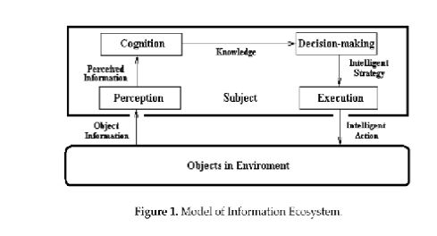

# Clase 3: 27/03/2023

<!-- Pagina 12-->

# Knowledge-that

* Conocimiento que yo sé
  * Condición de creencia
    * Confianza y seguridad que se tiene de esa *afirmación*
  * Condición de verdad
    * Uno *solo* puede *conocer* aquelas *cosas que son verdad*
  * Condición de justificación
    * Razones y explicación
    * Su ausencia implica a la *suerte*

## ¿Importancia?

1. Conocimiento Declarativo:
   * Predescible
   * Explicativo
   * Verificativo
   * En función a la experiencia, y no sabes porque suceden las cosas
2. Conocimiento Procedural
   * Habilitar y ser capaz de hacer
   * Experimentación
   * Aplicación
   * En función a la secuencia de pasos, donde se nos indicá lo que se tiene que hacer

# Information Ecosystem



# Sistemas de Información

<h2> Temas: </h2>

* Sistema
* Sistemas de información:
  * Introducción
  * Componentes
  * Clasificación y evolución

## Sistemas:

```
Conjunto de elementos que presentan un funcionamiento interno, transforman
entradas y salidas, e interactúan entre sí, para el logr de un fin común, y que
se encuentran en un intercambio dinámico con el medio ambiente en el que están inmeroso."
```

### Tipos de sistemas

* Sociales
* Judiciales
* Geográficos
* Administrativos
* Biológicos, ...


### Teoría General de Sistemas

* Isomorfismos: Similitudes diferentes campos: Estructuras
* Ej. Familias/ Personas vs empresas
  * Ambas están estructuradas
  * Nacen, crecen, unen, reproducen, separan, adoptan y mueren

#### Caracaterísitcas

* Holísticos(vs Reduccionismo)
* Abierto(vs Cerrado)
* Interdependencias
* Objetivo
* Propiedades
* Descubrimiento de problemas

